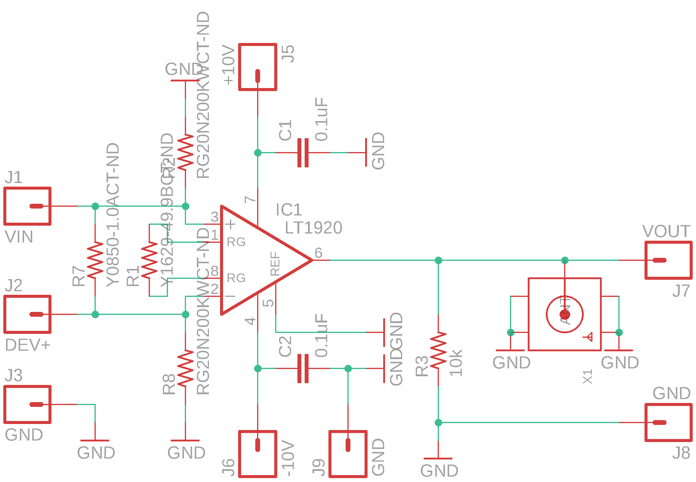
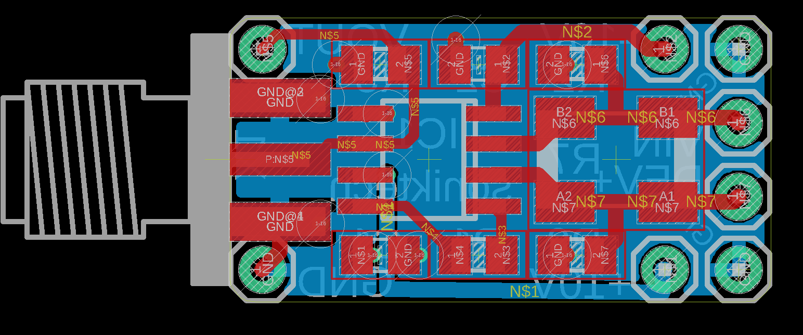

# current-amplifier
Useful for measuring circuit consumption under low-power conditions

While experimenting with low-power sleep modes for other projects, I was running into issues measuring current using normal multimeters and oscilloscopes.

This amplifier doesn't create a significant effect on the circuit being tested, and allows for a very high resolution image of how different sleep strategies perform in circuit.

